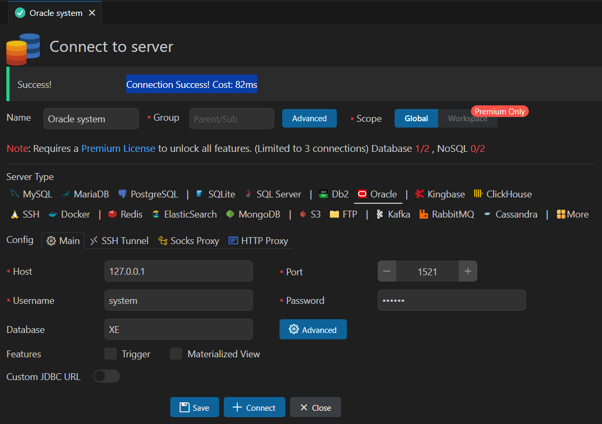

# Java-database-2025
Java 개발자 과정 Database 리포지토리

## 1일차
- Gitjub Desktop 설치
    - https://desktop.github.com/download/ 다운로드
    - 기존 Github계정으로 Signin with Browser
    - Git명령어 없이 사용가능

- Databasd(DB) 개요
    - 데이터를 저장하는 장소
    - 데이터베이스를 관리하는 프로그램 DBMS
    - 가장 유명한 것이 Oracle, MySQL
    - 사용자는 SQL로 요청, DB서버는 처리결과를 테이블로 리턴
    - SQL을 배우는 것!

- Oracle 설치
    1. Powershell 오픈
    2. docker pull 내려받기
        ```shell
        > docker pull oracleinanutshell/oracle-xe-11g
        ```
    3. 다운로드 이미지 확인
        ``` shell
        > docker image ls
        REPOSITORY                        TAG       IMAGE ID       CREATED        SIZE
        oracleinanutshell/oracle-xe-11g   latest    8b740e77d4b9   6 years ago    2.79GB
        ```
    4. 도커 컨테이너 실행
        ```
        > docker run --name oracle11g -d -p 1521:1521 --restart=always oracleinanutshell/oracle-xe-11g
        ```
        - 1521 : 오라클 기본포트
        - --name oracle11g : oracle11g 이름으로 컨테이너 생성
        - 아이디 system / oracle
        - --restart=always : 컨테이너가 중단되더라도 항상 다시 시작되도록 설정
        - oracleinanutshell/oracle-xe-11g라는 Docker 이미지를 사용
    5. 도커 실행확인
        - Kocker Desktop > Containers 확인
    6. Powershell 오픈
        ``` shell
        > docker exec -it oracle11g bash
        > [oracle@ ~]$ sqlplus / as sysdba
        SQL > 
        ```
    7. DBeaver 접속
        - Connection > Select your DB > Oracle 선택

        

- DBeaver Community 설치
     - https://dbeaver.io/download/
- DML, DDL, DCL
    - 언어의 특징을 가지고 있음
        - 프로그래밍 언어와 차이 : 어떻게(How)
        - SQL : 무엇(What)
    - SQL의 구성요소 3가지
        - DDL (Data Definition Lang) - 데이터베이스 생성, 테이블 생성, 객체 생성/수정/삭제
            - CREATE, ALTER, DROP, RENAME
        - DCL (Data Control Lang) - 사용자 권한 부여, 해제, 트랜잭션 시작/종료
            - GRANT, REVOKE, BEGIN TRANS, 
            - TCL : COMMIT, ROLLBACK
        - **DML** (Data Manupulation Lang) - 데이터 조작언어(핵심!), 데이터 삽입/조회/수정/삭제
            - `INSERT`, `SELECT`, `UPDATE`, `DELETE`

- SELECT 기본
    - 데이터 조회 시 사용하는 기본명령어
    ```sql
    -- 기본 주석(한줄)
    /* 여러줄 주석
       여러줄로 주석 작성가능 */
    SELECT [ALL|DISTINCT] [*|컬럼명(들)]
      FROM 테이블명(들)
    [WHERE 검색조건(들)]
    [GROUP BY 속성명(들)]
   [HAVING 집계함수조건(들)]
    [ORDER BY 정렬속성(들) ASCIDESC]
     [WITH ROLLUP]
    ```

    - 기본 쿼리 : [기본쿼리](./day01/sql01_select기본.sql)
        1. 기본 SELECT
        2. WHERE 조건절
        3. NULL(!)
        5. ORDER BY 정렬
        6. 집합

- 함수(내장함수)
    - 문자함수 : [함수](./day01/sql02_함수.sql)
    - 숫자함수

## 2일차
- 함수(계속) : [함수2](./day02/sql01_함수계속.sql)
    - 문자함수부터 
    - 숫자함수
    - 날짜함수
    - 형변환함수

- 복수행함수 : [복수행1](./day02/sql02_복수행함수.sql), [복수행2](./day03/sql01_복수행함수_마무리.sql)
    - 집계함수
    - GROUP BY
    - HAVING
    - ROLLUP
    - RANK, DENSE_RANK, ROW_NUMBER

- 데이터베이스 타입형
    - **CHAR(n)** - 고정형 문자열, 최대 2000바이트
        - CHAR(20)으로 'Hello World'를 입력하면, 'Hello World        '로 저장! (공백포함됨됨)
        - 기준코드나 반드시 자리수를 지켜야하는 데이터 필요요
    - **VARCHAR2(n)** - 가변형 문자열, 최대 4000바이트
        - VARCHAR2(20)으로 'Hello World'를 저장하면, 'Hello World'로 저장!
    - INTEGER - 모든 데이터의 기준. 4byte, 정수를 담는 데이터형
    - FLOAT(p) - 실수형 타입, 최대 22byte
    - NUMBER(p, s) - 숫자값, p 전체자리수, s 소수점길이. 최대 22byte
    - DATE - 날짜타입
    - LONG(n) - 가변길이 문자열, 최대 2G바이트
    - LONG RAW(n) - 원시이진 데이터ㅡ 최대 2G바이트
    - CLOB - 대용량 텍스트 데이터타입, 최대 4G
    - BLOB - 대용량 바이너리 데이터타입, 최대 4G
    - BFILE - 외부파일에 저장된 데이터, 4G

## 3일차
- JOIN : [JOIN](./day03/sql03_조인기본.sql)
    - ERD(Entity Relationship Kiagram) - 개체 관계 다이어그램
        - PK(Primary Key) - 기본키 / 중복이 안되고 빠진 데이터가 하나도 없다 / UNIQUE, NOT NULL
        - FK(Foreign Key) - 외래키 / 다른 언터티(테이블)의 PK. 두 엔터티의 관계를 연결해주는 값
        - Relationship - 부모 엔티티와 자식 엔티티간의 연관, 부모 1, 자식 N을 가질수 있음
    - 카티션곱
        - 두 개 이상의 테이블의 조건과 관계없이 연결할 수 있는 경우의수 모두 만든 데이터
        - 조인 이전에 데이터 확인 - 실무에서 카티션곱으로 데이터를 사용할 일이 절대! 없음음
    - 내부조인 
        - 다중 테이블에서 보통 PK와 FK간의 일치하는 데이터를 한꺼번에 출력하기 위한 방법
        - 관계형 데이터베이스에서 필수로 사용해야 함
        - INNER JOIN 또는 오라클 간결문법 사용
    - 외부조인
        - PK와 FK간 일치하지 않는 데이터도 출력하고자 할때 사용하는 방법
        - LEFT OUTER JOIN, RIGHT OUTER JOIN 또는 오라클 간결문법 사용

- DDL : [DDL](./day03/spl04_DDL.sql)
    - CREATE - TABLE, WIEW, PROCEDURE, FUNCTION / 개체를 생성하는 키워드
        - 타입형형
        ```sql
        CREATE TABLE 테이블명 (
            첫번째_컬럼  타입형  제약조건,
            두번째_컬럼  타입형  제약조건,
            ...
            마지막_컬럼  타입형  제약조건
            [
            기본키, 외래키 등의 옵션..
            ]
        );
        ```
    - ALTER - 개체 중 테이블에서 수정이 필요할 때 사용하는 키워드
        ```sql
        ALTER TABLE 테이블명 ADD (컬럼명 타입형 제약조건);
        ALTER TABLE 테이블명 MODIFY (컬럼명 타입형 제약조건);
        ```
    - DROP - 개체 삭제 시 사용하는 키워드
        ```sql
        DROP TABLE 테이블명 purge; -- purge:휴지통
        ```
    - TRUNCATE - 체이블 완전 초기화 키워드
        ```sql
        TRUNCATE TABLE 테이블명;
        ```
## 4일차
- VS XCdode DB플러그인
    - 확장 > Database 검색 > Database Client(Weijan Chen) > 확장중 Database 선택
    -   

- DML : [INSERT](./day04/sql01_INSERT.sql), [UPDATE/DELETE쿼리](./day04/sql02_UPDATE_DELETE.sql)
    - INSERT : 테이블에 새로운 데이터를 삽입하는 명령
        - 한 건씩 삽입입
        ```sql
        INSERT INTO 테이블명 [(컬럼리스트)]
        VALUES (값리스트);
        ```
        - 여러건 한꺼번에 삽입

    - UPDATE : 데이터 변경, WHERE 조건 없이 실행하면 테이블 모든 데이터가 수정됨 (주의요망!)
        ```sql
        UPDATE 테이블명 SET
            컬럼명 - 변경할값,
            [컬럼명 - 변경할값] -- 반복
        [WHERE 조건];
        ```
    - DELETE : 데이터 삭제, WHERE 조건 없이 실행하면 테이블 모든 데이터가 삭제됨 (주의요망!)
        ```sql
        DELETE FROM 테이블명
        [WHERE 조건];
        ```
    - 트랜잭션 : [트랜잭션](./day04/sql03_트랜잭션.sql)
        - 논리적인 처리단위.
        ex) 은행에서 돈을 찾을 때 아주 많은 테이블 접근해서 일을 처리
            - 적어도 7~8개 이상의 테이블에 접근하여 조회하고 업데이트 수행행
            - 제대로 일이 처리되지 않을경우 다시 원상복귀
            - DB 설정 AUTO COMMIT 해제 권장
            - ROLLBACK은 트랙잭션 종료가 아님. COMMIT만 종료.
            ```sql
            SET TRANSACTION READ WRITE;  -- 트랜잭션 시작(옵션)
            COMMIT;  -- 트랜잭선 확정
            ROLLBACK; --  원상복귀
            ```

- 제약조건(Constraint) : [제약조건](./day04/sql04_제약조건.sql)
    - 잘못된 데이터가 들어가지 않도록 막는 기법
        - PRIMARY KEY : 기본키, UIQUE NOT NULL, 중복되지 않고 없어도 안됨
        - FORIEGN KEY : 외래키, 다른 테이블 PK에 없는 값을 가져다 쓸 수 없음
        - NOT NULL : 값이 빠지면 안됨
        - UNIQUE : 들어간 데이터가 중복되면 안됨
        - CHECK : 기준에 부합하지 않는 데이터는 입력되면 안됨
        - DEFAULT : NULL 입력 시 기본값이 입력되도록 하는 제약조건
        ```sql
        CREATE TABLE 테이블명 (
            컬럼 생성 시 제약조건 추가
        );

        ALTER TABLE 테이블명 ADD CONSTRAINT 제약조건
        ```

- INDEX : [INDEX](./day04/sql05_인덱스.sql), [인덱스용테이블생성](./ref/bulk_data_insert.sql)
    - 책의 찾아보기와 동일한 기능
    - 검색을 매우 빨리 할 수 있도록 해줌
    - B(alanced) Tree를 사용해서 검색횟수를 log(n)건으로 줄임
    - 인덱스 종류
        - 클러스터드(Clustered) 인덱스 (테이블 당 1개)
            - PK에 자동으로 생성되는 인덱스 (무지빠름)
            - PK가 없으면 처음으로 설정되는 UNIQUE 제약조건의 컬럼에 생성
        - 보조(Non-Clustered) 인덱스 (여러개)
            - 사용자가 추가하는 인덱스
            - 클러스터드 인덱스보다 조금 느림
    - 유의점
        - PK에 자동 인덱스 후 컬럼에 UNIQUE를 걸어도 인덱스가 생성안됨. 수동으로 생성 필요
        - WHERE절에서 검색하는 컬럼은 인덱스를 걸어주는 것이 성능향상에 도움
        - 인덱스는 한 테이블당 4개 이상 걸면 성능 저하
        - NULL값, 중복값이 많은 컬럼에 인덱스는 성능 저하
        - INSERT, UPDATE, DELETE가 많이 발생하는 테이블에 인덱스를 걸면 성능 저하

        ```sql
        CREATE INDEX 인덱스명 ON 테이블명(인덱스걸컬럼명)
        ```
## 5일차
- VIEW : [VIEW](./day05/sql01_VIEW.sql)
    - 기존 테이블에서 권한별로 보일 수 있는 컬럼을 지정해서 만드는 개체 (보안목적적)
    - 기존 테이블 중 개인정보나 중요한 부분이 있으면 제외하고 보일 수 있음
    - 뷰라도 INSERTM, UPDATEM, DELETE가 가능함. 단일뷰가 가능
        ```sql
        CREATE VIEW 뷰명
        AS  
            SELECT 쿼리;
        [WITH READ ONLY]
        ```
    - 복합뷰는 두 개 이상의 테이블을 조인해서 만든 뷰. DML 기능이 (거의) 불가

- 서브쿼리 : [서브쿼리](./day05/sql02_서브쿼리.sql)
    - 메인쿼리를 도와주는 하위쿼리 뜻함. 소괄괄호() 내에 포함됨
    - 단일행 서브쿼리, 다중행 서브쿼리마다 사용법 다름
    - SELECT절(스칼라) 서브쿼리, FROM절 서브쿼리, WHERE절 서브쿼리
    - 서브쿼리는 JOIN으로 거의 다 변경가능 (안되는 경우도 있음)

- 시퀀스 : [시퀀스](./day05/sql03_시퀀스.sql)
    - 번호로 지정된 PK값을 자동으로 삽입할 수 있도록 도와주는 기능
    - 없어도 기능에는 차이가 없지만 효율을 위해서 사용
    - Oracle만 존재. 타 DB보다 자동증가값 사용이 불편
        ```sql
        CREATE SEQUENCE 시퀀스명
        INCREMENT BY 1  -- 증가값
        START WITH 1  -- 초기 시작값
        [MAXVALUE 999999]  -- 최대 증가값
        [CYCLE]  -- 최대 증가값에 도달하면 다시 처음1로 돌아갈것인지
        [CACHE]  -- 번호증가 캐쉬(대용량 삽입시만 관계)
        
        시퀀스명.NEXTVAL
        시퀀스명.CURRVAL
        ```

- 사용자 계정 권한 : [권한](./day05/sql04_사용자계정관리.sql)
    - 사용자 생성 후 권한(롤)을 부여해야 스키마를 사용가능

    ```sql
    -- 권한부여
    GRANT 권한|롤 TO 사용자 [WITH ADMIN|GRANT OPTION]; 
    -- 권한삭제
    REVOKE 권한|롤 FROM 사용자;
    ```

## 6일차
- PL/SQL : 
    - Oracle에서 프로그래밍을 하기 위한 언어 (파이썬처럼 코딩)
    - 기본구조
        - 선언부(DECLARE), 실행부(BEGIN~END), 예외처리부(EXCEPTION) 구성
    - Oracle 스키마 중 Packages, Procedures, Functions 이 PL/SQL로 작업하는 영역
        - 저장된(Stored) PL/SQL
    - 결과화면에 출력하려면 명령어를 실행하고 PL/SQL을 수행해야 함
        ```sql
        SET SERVEROUTPUT ON; -- 화면 출력기능 활성화
        SHOW ERRORS;  -- 오류 상세내용 보기
        ```

- Stored Procedure와 Function을 만들기 위해서 사용
    - 저장프로시저
        - 한꺼번에 많은 일을 수행해야할 때 (Transaction당 수행되는 로직들 묶어서)
        ex) 한번에 5개의 테이블에서 조회와 DML을 처리해야한다
            - 쿼리를 최소 10개를 수행해야 함
            - 프로시저 한번만 수행해서 해결할 수 있음
        - 중대형 IT솔루션에서는 프로시저가 거의 필수

        ```sql
        CREATE OR REPLACE PROCEDURE 프로시저명
        (
            param1 datatype1,
            param2 datatype2,
            ...
        )
        IS | AS
        PL/SQL Block;
        /
        ```

        - 실행 시 EXEC를 사용해야함 -- 데이터베이스에서만
        ```sql
        CALL 프로시저명 (파라미터);
        EXEC 프로시저명 (파라미터);  -- DBeaver에서 사용불가
        ```
    - 함수
        - 스칼라 값을 리턴할 때 - SELECT절 서브쿼리와 기능이 동일
        - 개발자에게 편의성을 제공하기 위해서 만듬

        ```sql
        CREATE OR REPLACE FUNCTION 함수명
        (
            param1 datatype,
            ...
        )
        RETURN datatype
        IS | AS
        PL/SQL Block
        ```

        - 실행 시 SELECT문과 DML문과 같이 사용
        ```sql
        SELECT *, 함수명(파라미터)
          FROM 컬럼명;
        ```

    - 커서
        - DB에서 테이블에 들어있는 데이터를 한줄씩 읽기 위해서 필요
        ```sql
        CURSOR 커서명 IS
        SELECT 쿼리; 
        ```

    - 트리거
        - 특정 동작으로 다른 테이블에 자동으로 데이터가 변경되는 기능
        - 한가지 동작에 대해서 연쇄적으로 다른일 발생
        ```sql
        CREATE OR REPLACE TRIGGER 트리거명
        BEFORE|AFTER INSERT|UPDATE|DELETE ON 테이블{뷰}이름
        BEGIN
            PL/SQL쿼리
        END;
        ```

## 7, 8일차
- Oracle 연동 Python GUI 프로그램 개발
    - [토이프로젝트](./ToyProject/README.md)