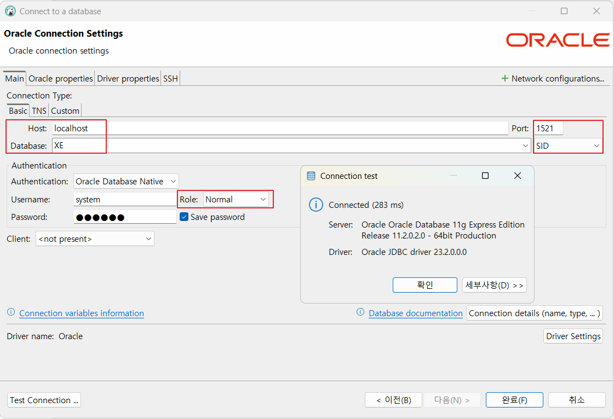

# Java-database-2025
Java 개발자 과정 Database 리포지토리

## 1일차
- Gitjub Desktop 설치
    - https://desktop.github.com/download/ 다운로드
    - 기존 Github계정으로 Signin with Browser
    - Git명령어 없이 사용가능
- Databasd(DB) 개요
    - 데이터를 저장하는 장소
    - 데이터베이스를 관리하는 프로그램 DBMS
    - 가장 유명한 것이 Oracle, MySQL
    - 사용자는 SQL로 요청, DB서버는 처리결과를 테이블로 리턴
    - SQL을 배우는 것!
- Oracle 설치
    1. Powershell 오픈
    2. docker pull 내려받기
        ```shell
        > docker pull oracleinanutshell/oracle-xe-11g
        ```
    3. 다운로드 이미지 확인
        ``` shell
        > docker image ls
        REPOSITORY                        TAG       IMAGE ID       CREATED        SIZE
        oracleinanutshell/oracle-xe-11g   latest    8b740e77d4b9   6 years ago    2.79GB
        ```
    4. 도커 컨테이너 실행
        ```
        > docker run --name oracle11g -d -p 1521:1521 --restart=always oracleinanutshell/oracle-xe-11g
        ```
        - 1521 : 오라클 기본포트
        - --name oracle11g : oracle11g 이름으로 컨테이너 생성
        - 아이디 system / oracle
        - --restart=always : 컨테이너가 중단되더라도 항상 다시 시작되도록 설정
        - oracleinanutshell/oracle-xe-11g라는 Docker 이미지를 사용
    5. 도커 실행확인
        - Kocker Desktop > Containers 확인
    6. Powershell 오픈
        ``` shell
        > docker exec -it oracle11g bash
        > [oracle@ ~]$ sqlplus / as sysdba
        SQL > 
        ```
    7. DBeaver 접속
        - Connection > Select your DB > Oracle 선택

        

- DBeaver Community 설치
     - https://dbeaver.io/download/
- DML, DDL, DCL
    - 언어의 특징을 가지고 있음
        - 프로그래밍 언어와 차이 : 어떻게(How)
        - SQL : 무엇(What)
    - SQL의 구성요소 3가지
        - DDL (Data Definition Lang) - 데이터베이스 생성, 테이블 생성, 객체 생성/수정/삭제
            - CREATE, ALTER, DROP, RENAME
        - DCL (Data Control Lang) - 사용자 권한 부여, 해제, 트랜잭션 시작/종료
            - GRANT, REVOKE, BEGIN TRANS, 
            - TCL : COMMIT, ROLLBACK
        - **DML** (Data Manupulation Lang) - 데이터 조작언어(핵심!), 데이터 삽입/조회/수정/삭제
            - `INSERT`, `SELECT`, `UPDATE`, `DELETE`
- SELECT 기본
    - 데이터 조회 시 사용하는 기본명령어
    ```sql
    -- 기본 주석(한줄)
    /* 여러줄 주석
       여러줄로 주석 작성가능 */
    SELECT [ALL|DISTINCT] [*|컬럼명(들)]
      FROM 테이블명(들)
    [WHERE 검색조건(들)]
    [GROUP BY 속성명(들)]
   [HAVING 집계함수조건(들)]
    [ORDER BY 정렬속성(들) ASCIDESC]
     [WITH ROLLUP]
    ```

    - 기본 쿼리 : [SQL](./day01/sql01_select기본.sql)
        1. 기본 SELECT
        2. WHERE 조건절
        3. NULL(!)
        5. ORDER BY 정렬
        6. 집합

- 함수(내장함수)
    - 문자함수 : [SQL](./day01/sql02_함수.sql)
    - 숫자함수

## 2일차