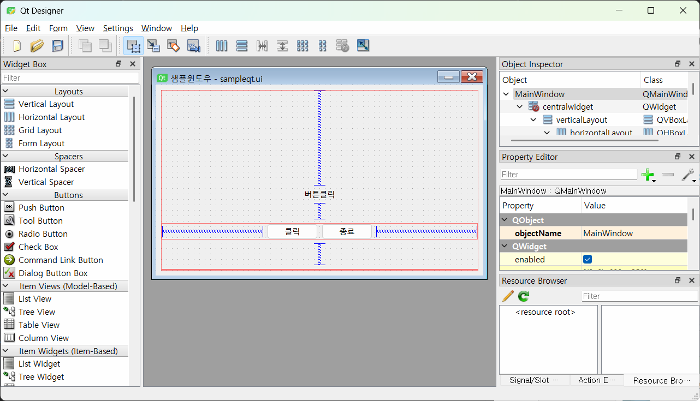
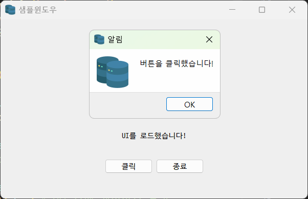
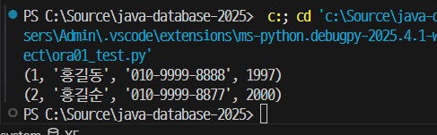
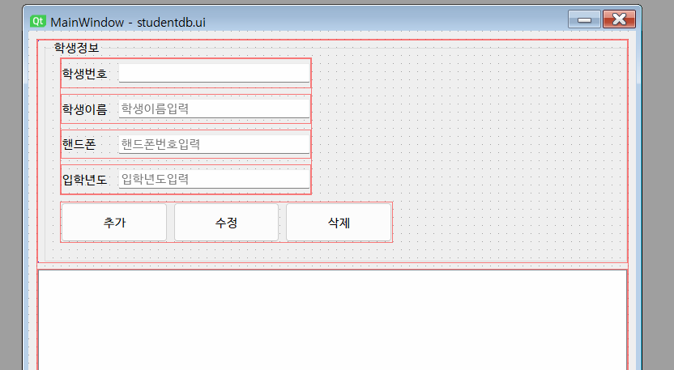
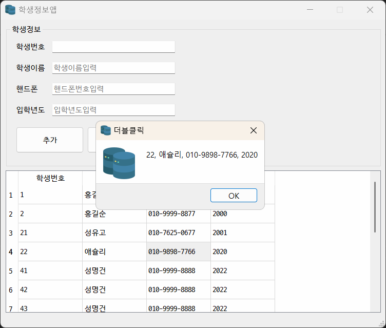
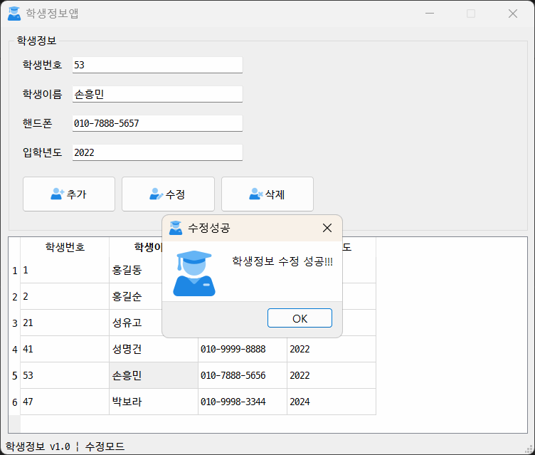
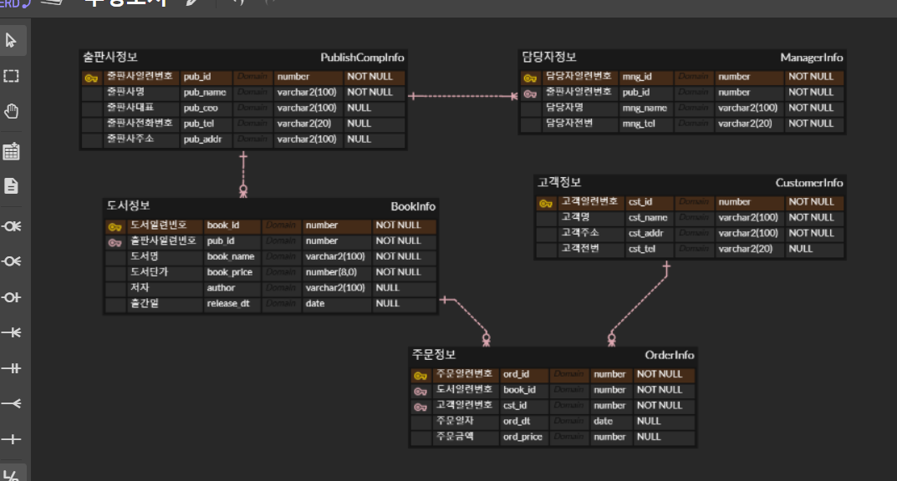
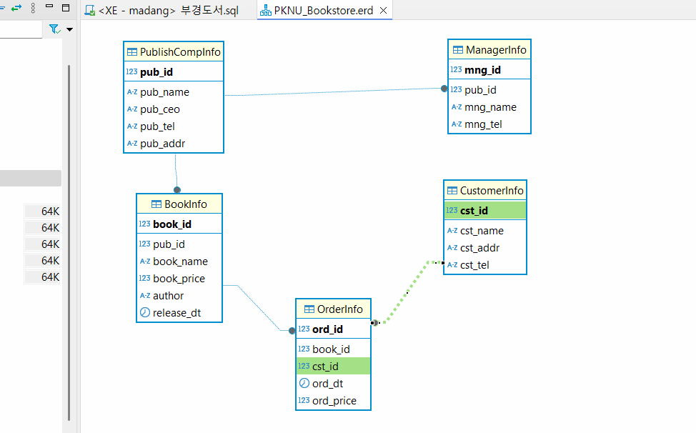

## 토이프로젝트
Python GUI - Oracle 연동 프로그램

### GUI 프레임워크
- GUI 프레임워크
    1. tkinter 
        - 파이썬 내장된 GUI 라이브러리. 중소형 프로그램 사용. 간단하게 사용가능하나 안 이쁨.
    2. **PyQt** / Pyside
        - C/C++에서 사용하는 GUI프레임워크 Qt를 파이썬에 사용하게 만든 라이브러리. 현재 6버전 출시. 유료
        - PyQt의 사용라이선스 문제로 PySide 릴리즈. PyQt에서 PySide변경하는데 번거로움 
        - tkinter보다 난이도가 있음
        - 아주 이쁨. QtDesigner툴로 포토샵처럼 GUI를 디자인 가능
        - Python GUI중에서 가장 많이 사용중
    3. Kivy
        - OpenGL(게임엔진용 3D 그래픽엔진)으로 구현되는 GUI 프레임워크
        - 안드로이드, ios 등 모바일용으로도 개발가능
        - 최신에 나온 기술이라 아직 불안정
    4. wxPython
        - Kivy처럼 멀티플랫폼 GUI 프레임워크
        - 무지 어려움

### PyQt5 GUI 사용
- PyQt5 설치
    - @콘솔 `pip install PyQt5`

- QtDesigner 설치
    - https://build-system.fman.io/qt-designer-download 다운로드 후 설치

     

#### PyQt5 개발
1. PyQt 모듈 사용 원앱 만들기
2. 윈도우 기본설정
3. PyQt 위젯 사용법 (레이블, 버튼, ...)
4. 시그널(이벤트) 처리방법
5. QtDesigner로 화면디자인, PyQt와 연동

     

#### Oracle연동 GUI개발 시작
- 오라클 Python연동 DB(스키마) 생성
- student 테이블 생성, 더미데이터 추가
    ```sql
    -- sys(sysdba)로 작업
    -- madang 스키마, 사용자 생성
    CREATE USER madang IDENTIFIED BY madang;

    -- 권한 설정
    GRANT CONNECT, resource TO madang;

    -- madang으로 사용 스키마 변경

    -- 체이블 Student 생성
    CREATE TABLE Students (
        std_id NUMBER PRIMARY KEY,
        std_name VARCHAR2(100) NOT NULL,
        std_mobile VARCHAR2(15) NULL,
        std_regyear NUMBER(4,0) NOT NULL
    );

    -- Students용 시퀀스 생성
    CREATE SEQUENCE SEQ_STUDENT
        INCREMENT BY 1   -- 숫자를 1씩 증가
        START WITH 1;    -- 1부처 숫자가 증가됨
        
    COMMIT;

    -- 사용자 madang으로 변경
        
    -- madang 로그인

    --조회
    SELECT * FROM students;

    -- 더미데이터 삽입
    INSERT INTO Students(STD_ID, STD_NAME, STD_MOBILE, STD_REGYEAR)
    VALUES (SEQ_STUDENT.nextval, '홍길동', '010-9999-8888', 1997);
    INSERT INTO Students(STD_ID, STD_NAME, STD_MOBILE, STD_REGYEAR)
    VALUES (SEQ_STUDENT.nextval, '홍길순', '010-9999-8877', 2000);

    COMMIT;
    ```
- Python 오라클 연동 테스트
    - 오라클 모듈
        - oracledb : Oracle 최신버전에 매칭 (구버전 사용불가)
        - **cx_Oracle** : 구버전까지 잘 됨
    - [Macrosoft C++ Build Tools](https://visualstudio.microsoft.com/ko/visual-cpp-build-tools/) 필요
        - Visual Studio Installer 실행
        - 개별 구성요소
            - [x] MSVC v1XX - VS 20XX C++ x64/x86 빌드도구
            - [x] C++ CMake Tools for Window
            - [x] Windows 10 SDK(10.0.xxxxx)
        - 설치
    - 콘솔에서 `> pip install cx_Oracle`
    - 콘솔 오라클연동 : [python](./)
        - DPI-1047오류발생
        - 64-bit Oracle Client Library가 OS에 설치되지 않았기 때문에 발생하는 현상
        - 아래 사이에서 버전에 맞는 Oracle Client를 다운로드
        - https://www.oracle.com/kr/database/technologies/instant-client/winx64-64-downloads.html
        - 11g 다운로드
        - 압축해제(C:\DEV\Tool\instantclient_11_2), 시스템정보 Path 등록
        - 재부팅!
    - 콘솔 테스트 결과
         
    
- QtDesigner로 화면 구성
     

- PyQt로 Oracle 연동 CRUD 구현
    - 조회 SELECT 구현
    - 삽입 INSERT 구현
    - 수정, 삭제 구현
    - 입력값 검증 (Validation check) 로직
    - DML이 종료된 후 다시 데이터 로드 로직 추가
    - 데이터 삽입 후 라인에디트에 기존 입력값이 남아있는 것 제거

     

- 개발도중 문제
    [x] DB 수정모드에서 추가를 눌러도 새로 데이터가 삽입됨
    [x] 수정모드에서 추가를 한 뒤 학생번호가 라인에디트 그대로 존재

- 개발완료 화면
    - 아이콘 변경 및 추가
     

### 데이터베이스 모델링
- 서점 데이터 모델링
    - 현실세계 데이터를 DB내에 옮기기 위해서 DB를 설계하는 것
    - 모델링 중요점
        1. 객체별로 분리할 것 -> 테이블(엔티티)
        2. 각 객체별로 어떤 속성을 가지고 있는지 분리. 속성 -> 컬럼
        3. 어느 객체와 어느 객체가 관련이 있는지 분석. 부모객체와 자식객체의 관련을 정립. 관계, PK/FK
        4. 한 컬럼에 데이터를 한 개의 테이터만 저장되는지 파악
        5. 결정자가 없으면 어떻게만들지 파악. 결정자 -> PK
    - 모델링 순서
        1. 객체분리 - 고객정보, 도서정보, 출판사정보, 주문정보
        2. 속성분리 - 일반속성, 결정자(PK)속성 
    - ERD툴 사용해서 모델링
        - ERDCloud.com(Web), ERwin(App), Draw.io

- ERDCloud.com
    1. ERD 생성버튼으로 새 ERD 이름작성 후 생성
    2. 논리모델링 시작
        - 새 엔티티 추가
        - 엔터티 속성 추가 (속성명, 타입, NULL여부)
        - 결정자(PK) 속성 일부 추가
        - 관계(7가지 아이콘) 연결
        - 필요없는 속성제거, 필요한 속성추가
    3. 물리모델링
        - 엔치치의 테이블명 입력
        - 각 속성 컬럼명 입력
        - DB에 맞게 타입과 크기를 변경 (Oracle, MySQL 등)
         
    4. 내보내기
        - DB변경
        - PK제약조건, FK제약조건, 비식별제약조건 선택
        - SQL 미리보기로 확인
        - SQL 다운로드
    5. DBeaver
        - 내보내기한 sql 오픈
        - 스크럽트 실행
        - ER다이어그램 그리기
         